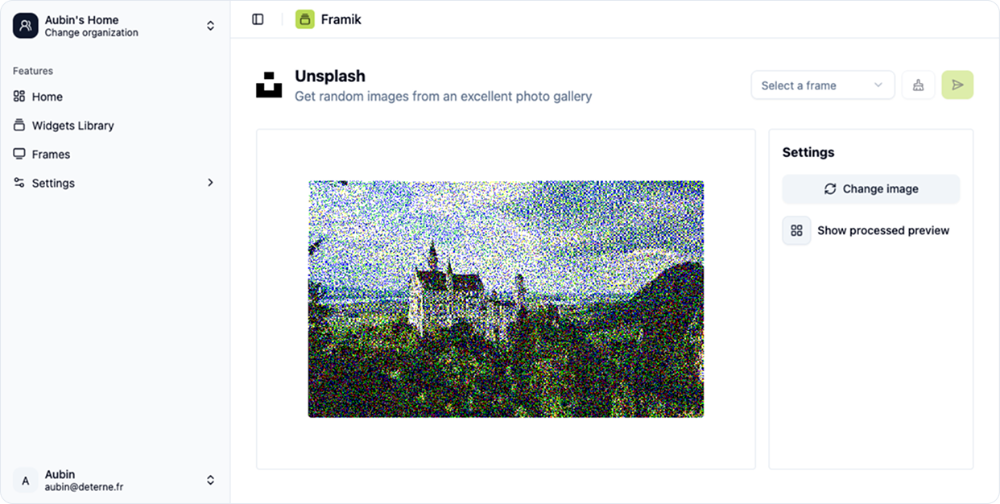

# Framik
> Use an epaper screen as a beautiful frame. Show photos, widgets (calendar, weather, ...)



## Requirements

**Main server machine**

- bun `curl -fsSL https://bun.sh/install | bash`

> Useful alias
> ```sh
> alias framik_stop='pid=$(lsof -ti tcp:4173); [ "$pid" ] && kill -9 "$pid" || echo "Nothing to kill on port 4173"'
> alias framik_start="cd $HOME/framik/apps/web && nohup bun start > "logs/log_$(date +%Y%m%d_%H%M%S).log" 2>&1 &"
> alias framik_build="cd $HOME/framik && bun i --ignore-scripts --filter ./apps/web && bunx turbo build --filter@framik/web --force"
> ```

**Daemon machine**

- bun `curl -fsSL https://bun.sh/install | bash`
- gpio `sudo apt install gpiod libgpiod-dev`

> Useful alias
> ```sh
> alias framik_stop='pid=$(lsof -ti tcp:3000); [ "$pid" ] && kill -9 "$pid" || echo "Nothing to kill on port 3000"'
> alias framik_start="cd $HOME/framik/apps/daemon && nohup bun start > "logs/log_$(date +%Y%m%d_%H%M%S).log" 2>&1 &"
> alias framik_build="cd $HOME/framik && bun i && bunx turbo build --filter@framik/daemon --force"
> ```

## Setup project
```bash
# Install dependencies
bun i
# Run database migration
cd apps/web && bun db:push
# Start the dev server
bun dev
```

## Useful tools
- API call can be done using [Yaak](https://yaak.app/) by loading the yaak folder as a workspace
